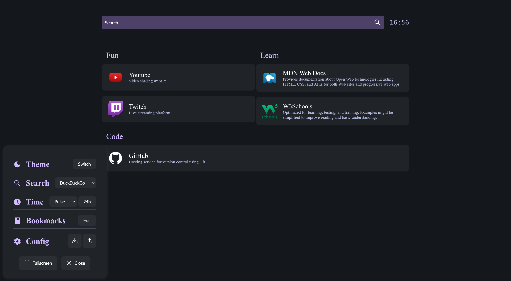
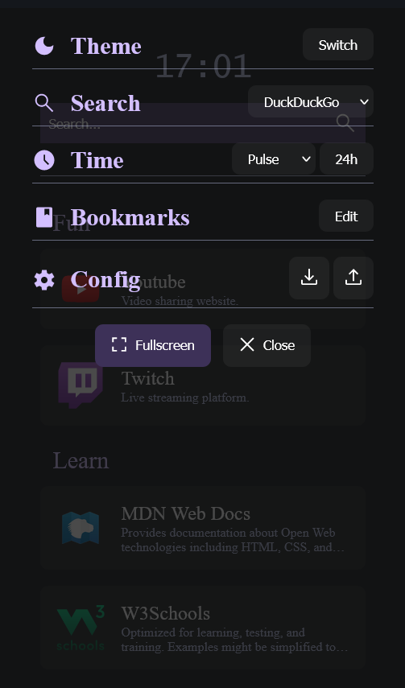

# gh0stzk-s-firefox-extension

Thanks to [benphelps](https://github.com/benphelps) for the original idea, thanks to [gh0stzk](https://github.com/gh0stzk) for the color scheme.

This is a static homepage to start the browser with. It is a simple HTML page with:

* a search bar,
* a clock,
* a list of bookmarks.

## Preview

### Dark

[](../img/dark.png)

### Light

[](../img/light.png)

### Responsive

[](../img/responsive.png)

### Responsive settings

[](../img/responsive-settings.png)

### (new) RSS feed

[](../img/rss.png)

## Why?

I use Firefox as my main browser. I like to have a clean start page, but I also like to have a list of bookmarks that don't change over time.

I have a server running at home so I first used the work of [benphelps](https://github.com/benphelps/homepage) to get it. Though when you have a laptop you ought to move it around and then the page crashes because it can't reach the server.

So I decided to make a static version of the homepage. I heavily modified the original look and feel to my liking so the homepage merges perfectly with my [config](https://github.com/gh0stzk/dotfiles/tree/master/misc/firefox).

## Installation

Install the Firefox extension from [addons.mozilla.org](https://addons.mozilla.org/fr/firefox/addon/gh0stzk-s-homepage/). The extension is prefered because it allows to use the `newtab` page as the homepage and will be updated automatically.

### OR

1. Clone this repository (somewhere it won't bother you. I use `~/mozilla/homepage/`)
2. Open `index.html` in your browser
3. Copy the URL of the page
4. Set the URL as your homepage in your browser.

## Bookmarks

Here is the format:

```json
[
  {
    "category": "The category name - e.g. 'Development'",
    "fullWidth": true, // Optional, default: false
    "links": [
      {
        "name": "The name of the link",
        "url": "The URL of the link",
        "description": "A description of the link",
         "icon": "The URL of the icon (URL or data URI or local path to file)"
      },
      {
        "name": "GitHub",
        "url": "https://www.github.com/",
        "description": "Hosting service for version control using Git.",
        "icon": "https://github.githubassets.com/favicons/favicon.svg"
      }
    ]
  },
]
```

### Icons

Here is the list of icons included in the extension:

| Icon | Name |
| ---- | ---- |
|  | `1337X.svg` |
|  | `amazon-prime-video.svg` |
|  | `archlinux.svg` |
|  | `binance.svg` |
|  | `bot-ghost.svg` |
|  | `canal-plus.svg` |
|  | `canal-plus-white.svg` |
|  | `cardmarket.svg` |
|  | `cesi.svg` |
|  | `debian.svg` |
|  | `disney-plus.svg` |
|  | `emby.svg` |
|  | `facebook.svg` |
|  | `font-awesome.svg` |
|  | `gitea.svg` |
|  | `github.svg` |
|  | `gitlab.svg` |
|  | `glpi.svg` |
|  | `gmail.svg` |
|  | `google-drive.svg` |
|  | `ibm.svg` |
|  | `jdownloader.svg` |
|  | `jetbrains.svg` |
|  | `js-discord.svg` |
|  | `kaggle.svg` |
|  | `linguee.svg` |
|  | `linkedin.svg` |
|  | `lutris.svg` |
|  | `markdown.svg` |
|  | `markdown-white.svg` |
|  | `materialize.svg` |
|  | `mdn.png` |
|  | `microsoft.svg` |
|  | `microsoft-azure.svg` |
|  | `microsoft-teams.svg` |
|  | `microsoft-teams-white.svg` |
|  | `microsoft-word.svg` |
|  | `microsoft-word-white.svg` |
|  | `moodle.svg` |
|  | `netflix.svg` |
|  | `nexus-mods.svg` |
|  | `openai.svg` |
|  | `openai-white.svg` |
|  | `overleaf.svg` |
|  | `pixabay.svg` |
|  | `pixabay-white.svg` |
|  | `protondb.svg` |
|  | `protonmail.svg` |
|  | `redhat.svg` |
|  | `slack.svg` |
|  | `tempmail.svg` |
|  | `twitch.svg` |
|  | `vercel.svg` |
|  | `vercel-white.svg` |
|  | `whatsapp.svg` |
|  | `w3schools.svg` |
|  | `wikipedia.svg` |
|  | `wikipedia-white.svg` |
|  | `wolframAlpha.svg` |
|  | `wolframAlpha-2.svg` |
|  | `yandex.svg` |
|  | `youtube.svg` |

## More

If you want to keep the color sheme over other pages, you can find the settings for the **Dark-Reader** extension in `./shared/Dark-Reader-Settings.json`:

* Install the [Dark-Reader](https://addons.mozilla.org/en-US/firefox/addon/darkreader/) extension if not already installed.
* Open the extension settings.
* Click on the **Manage settings** button.
* Click on the **Import** button.
* Select the `Dark-Reader-Settings.json` file.
